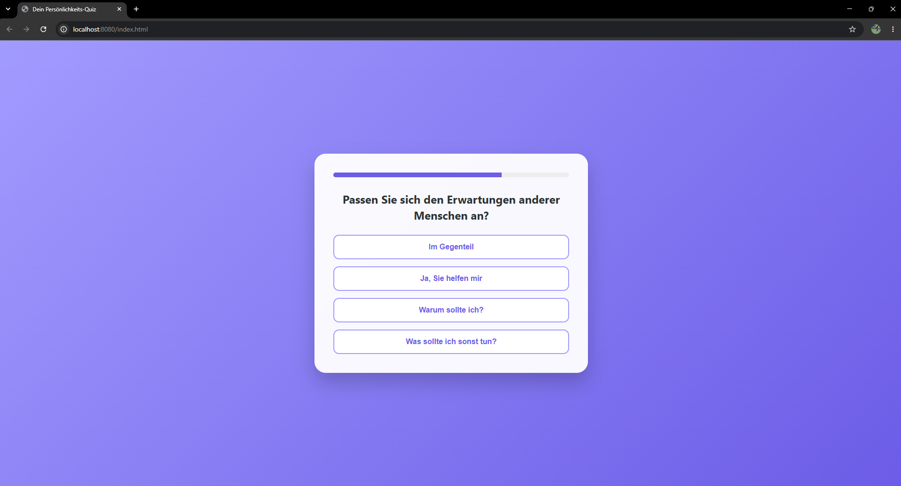
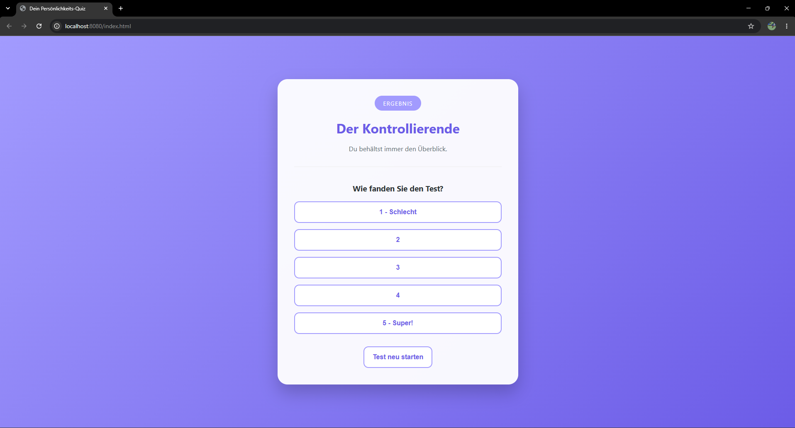
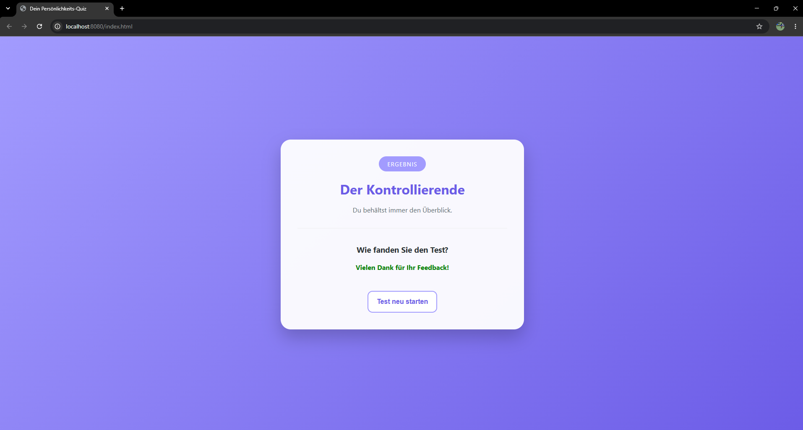
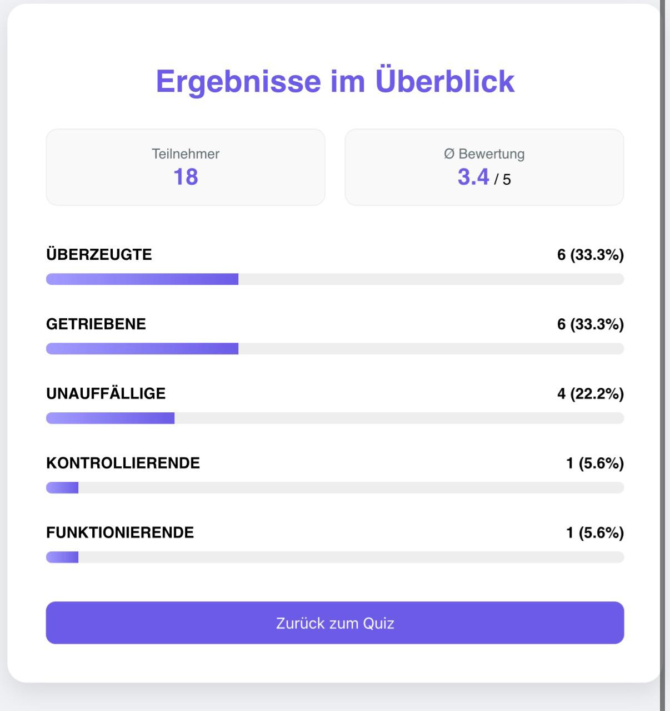

# Personality Quiz

A web-based personality quiz developed as part of an **art project about pigeonholing and simplified social categorization**.

The application deliberately assigns users to a small set of exaggerated personality types. The goal is not to provide a scientific personality assessment, but to make the limitations of reducing people to simple categories visible through an interactive experience.

## Concept

The quiz presents a sequence of multiple-choice questions. Each answer contributes points to one of five predefined categories:

- **Der Funktionierende**
- **Der Getriebene**
- **Der Unauffällige**
- **Der Überzeugte**
- **Der Kontrollierende**

At the end, the highest-scoring category is presented as the result. Users can then rate the quiz, and the submitted result is stored for the statistics view.

> **Note:** The personality types are intentionally simplified and exaggerated as part of the artistic concept. This project is not intended as a psychological or scientific personality test.

## Application Workflow

### 1. Answer the Quiz

Questions are loaded from the Spring Boot backend and displayed one after another in the web interface.

<p align="center">
  
</p>

### 2. Receive a Personality Type

The selected answers are scored and mapped to one of the predefined personality categories.

<p align="center">
  
</p>

### 3. Submit Feedback

After receiving the result, users can rate the quiz. The personality type and rating are submitted to the backend and stored in the database.

<p align="center">
  
</p>

### 4. Evaluate the Results

A separate statistics page aggregates the stored results and displays:

- total number of participants
- average user rating
- distribution of the personality types

<p align="center">
  
</p>

## Features

- interactive multi-step personality quiz
- progress indicator
- answer-based scoring system
- five predefined personality categories
- result page with category description
- user rating after completing the quiz
- persistent result storage
- statistics dashboard
- type distribution visualization
- average rating calculation
- REST API between frontend and backend
- local H2 database
- Docker-based deployment setup
- deployed online using Railway

## Architecture

```text
Browser
  │
  │ HTML / CSS / JavaScript
  │
  v
Spring Boot Web Application
  │
  ├── GET  /api/questions
  ├── GET  /api/types/{id}
  ├── POST /api/submit-result
  └── GET  /api/stats
           │
           v
      Spring Data JPA
           │
           v
        H2 Database
```

The frontend is served directly by Spring Boot from `src/main/resources/static`, while the Java backend provides the quiz data, result types and statistics endpoints.

## Tech Stack

- **Java 17**
- **Spring Boot**
- **Spring Web**
- **Spring Data JPA**
- **H2 Database**
- **HTML**
- **CSS**
- **JavaScript**
- **Maven**
- **Docker**
- **Railway**

## REST API

### `GET /api/questions`

Returns the quiz questions and the answer options used by the frontend.

### `GET /api/types/{id}`

Returns the name and description of a personality type.

### `POST /api/submit-result`

Stores the resulting personality type together with the user rating.

Example payload:

```json
{
  "type": "KONTROLLIERENDE",
  "rating": 5
}
```

### `GET /api/stats`

Returns aggregated quiz statistics including:

```json
{
  "counts": {
    "KONTROLLIERENDE": 1
  },
  "averageRating": 5.0,
  "totalParticipants": 1
}
```

## Project Structure

```text
personality-quiz/
├── .mvn/
├── src/
│   ├── main/
│   │   ├── java/com/emilia/quiz/
│   │   │   ├── PersonalityType.java
│   │   │   ├── Question.java
│   │   │   ├── QuizApplication.java
│   │   │   ├── QuizController.java
│   │   │   ├── QuizResult.java
│   │   │   └── QuizResultRepository.java
│   │   └── resources/
│   │       ├── static/
│   │       │   ├── index.html
│   │       │   └── stats.html
│   │       └── application.properties
│   └── test/
├── docs/
│   └── screenshots/
├── Dockerfile
├── pom.xml
├── mvnw
├── mvnw.cmd
└── .gitignore
```

## Running Locally

### Requirements

- Java 17 or newer
- no separate Maven installation required when using the Maven Wrapper

### Windows

```powershell
.\mvnw.cmd spring-boot:run
```

### Linux / macOS

```bash
./mvnw spring-boot:run
```

Then open:

```text
http://localhost:8080/
```

The statistics page is available at:

```text
http://localhost:8080/stats.html
```

## Database

The application uses a file-based H2 database for local development.

The database is created automatically when the application starts and is intentionally excluded from version control. This keeps locally collected quiz results out of the public repository.

## Deployment

The project includes a `Dockerfile` and was deployed online using **Railway** during the project.

The deployment makes it possible to use the quiz outside the local development environment while keeping the same Spring Boot application structure.

## Project Status

**Completed / operational**

The project was built as a functional web application for an artistic concept and includes both the interactive user experience and a backend for collecting and evaluating results.

## License

This project is licensed under the MIT License. See [LICENSE.md](LICENSE.md) for details.

## Author

**Leon Stein**

Technical projects in software, embedded systems and automation.
